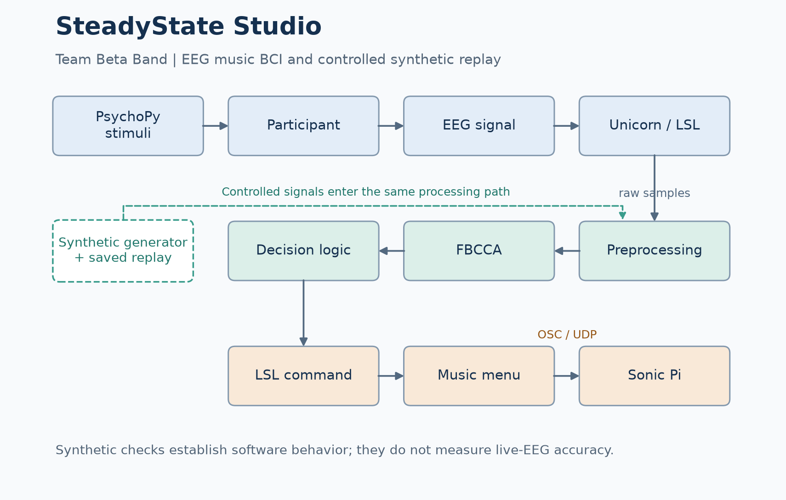
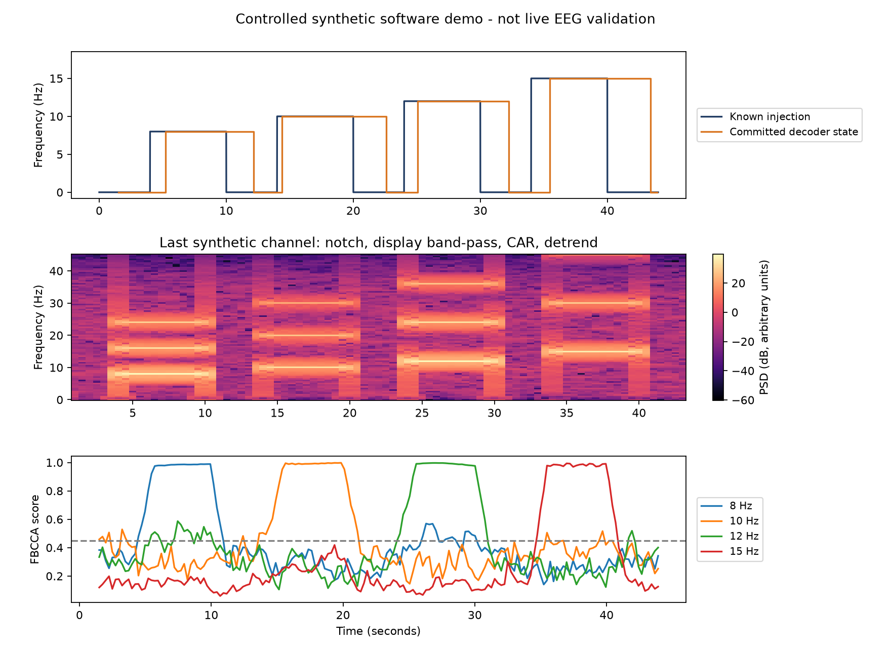

# SteadyState Studio: EEG-Based BCI for Music Generation

We built SteadyState Studio as **Team Beta Band** to explore controlling music with steady-state visually evoked potentials (SSVEPs). Four flickering targets drive a menu for choosing an instrument, selecting a loop, and adding, removing or restarting musical layers. We used an eight-channel Unicorn EEG headset, LSL, a PsychoPy interface and Sonic Pi.

The music comes from predefined loops: we combine and control those layers through the BCI. The installable CLI and automated demo checks extend the hackathon project with a reproducible way to explore the pipeline. You can generate synthetic EEG, decode it offline or replay it through LSL, and inspect commands without a headset or Sonic Pi.

## Quickstart without EEG hardware

Use Python 3.10 or newer. From this repository:

```sh
python -m pip install .
python -m neurovision demo
```

For an isolated environment on Windows:

```powershell
python -m venv .venv
.venv\Scripts\Activate.ps1
python -m pip install .
python -m neurovision demo
```

On macOS/Linux, activate with `source .venv/bin/activate`. If PowerShell activation is restricted, run `.venv\Scripts\python.exe` directly.

The core install needs only NumPy and SciPy. The demo presents no flicker and plays no audio. It generates a seeded schedule containing all four targets and rest periods, then checks the decoded state at the end of each block. Output goes to `demo-output/`:

- `synthetic.npz`: samples, injected frequencies, seed and configuration.
- `decoder.jsonl`: per-window scores, gate actions and committed states.
- `report.json`: the expected and decoded state for each block.

These files are labelled as synthetic demonstration data. Frequency labels are used for checking the output and are never passed into the decoder.

To run the same example over actual local LSL transport:

```sh
python -m pip install ".[lsl]"
python -m neurovision demo --lsl
```

This takes about 44 seconds of signal time. `python -m neurovision --help` lists all commands; the installed `neurovision` command is equivalent.

## System architecture



PsychoPy stimuli → participant → EEG → Unicorn/LSL → preprocessing → FBCCA → decision logic → LSL command → music menu → OSC/UDP → Sonic Pi.

Synthetic generation and saved replay enter at the EEG/LSL boundary. Offline replay uses the same preprocessing and decoding code.

## Signal processing and FBCCA

We process the selected EEG channels in **1.5-second windows** with a nominal **0.25-second step**, at **250 Hz** by default. Each window passes through:

1. A 50 Hz notch filter with Q = 30.
2. Common average referencing across the selected EEG channels.
3. Linear detrending per channel.
4. Three fourth-order Butterworth band-pass filters: 6–15, 15–25 and 25–40 Hz.
5. Filter Bank Canonical Correlation Analysis (FBCCA) against sine/cosine references for **8, 10, 12 and 15 Hz**, each with three harmonics.

Filtering uses forward/backward operations on complete windows. The separate spectrum display uses a 1–40 Hz band-pass; this is not an extra decoding stage. At 250 Hz, rounding gives 375 samples per window and a 62-sample step, or 0.248 seconds. Window scheduling is independent of incoming chunk size.

For each target, we combine squared canonical correlations with weights `k^(-1.25) + 0.25` for the three filter bands and normalize by the sum of those weights. The covariance ridge is `1e-6`. FBCCA is an established method; the resulting scores are similarity measures, not calibrated probabilities.

## Decisions and no-control

A target needs a best score of at least **0.45**, a margin of at least **0.06** over the next target, and **four** consecutive passing windows. **Six** consecutive failing windows return the decoder to no-control. `HOLD` keeps the committed state while a decision is pending.

Commands are emitted only when the committed state changes. To choose the same corner on consecutive menu screens, return to no-control before choosing it again, or choose a different corner between steps. The interface discards commands during its one-second selection cooldown.

LSL commands use `SSVEP_IDX=...;FREQ=...;S=...;M=...` for a target and `SSVEP_NONE;FREQ=0;...` for no-control. Data gaps reset the window buffer and decision history; shutdown clears the command state. No-control describes failure of the score gates, not a physiological measurement of idle attention.

## Stimulus and music interface

PsychoPy updates each corner's opacity using `0.5 * (1 + sin(2πft))`:

| Corner / index | Frequency | Instrument | Action |
|---|---:|---|---|
| Top-left / 0 | 8 Hz | Drums | Add |
| Top-right / 1 | 10 Hz | Piano | Remove |
| Bottom-left / 2 | 12 Hz | Bass | Restart |
| Bottom-right / 3 | 15 Hz | Extra | Back |

The middle screen selects loops 1–4. A loop starts as a preview; Add keeps it and Remove stops it. Restart sends the global reset code `6969`. The current Sonic Pi engine aliases the fourth piano slot to the third piano loop and has some drum amplitude dependencies. See [music controls and OSC mapping](docs/music.md) for those details.

The interface starts with flickering off and audio in dry-run mode. Space toggles flicker, Q/W/A/S select corners, Backspace goes back, and Escape exits. BCI selections are accepted only while flickering is enabled. Verify physical stimulus timing on the monitor before using the paradigm with participants: refresh rate and dropped frames affect the displayed frequencies. Flicker can trigger discomfort or photosensitive seizures; participant use requires an appropriate supervised protocol.

## Synthetic generation, replay and inspection

We use multi-channel sinusoidal/harmonic signals with random channel amplitudes and phases, band-limited background noise, and optional line noise and drift. The default demo uses seed 42, SSVEP amplitude 80 and noise amplitude 2 in arbitrary units, with line noise and drift off. This is a deliberately favorable software check, not a calibrated physiological model.

```sh
python -m neurovision generate --out demo-output/synthetic.npz
python -m neurovision replay demo-output/synthetic.npz
python -m neurovision replay data/synthetic/ssvep_example.csv --config configs/csv.example.json
```

The example CSV contains six 15-second blocks: 15, 8, 10, off, 12 and off Hz. Its sample rate is specified in the replay config. Only the EEG columns enter the decoder; `Sample`, `TRIG`, `LABEL` and `TARGET_FREQ` are metadata.

For a labelled inspection plot:

```sh
python -m pip install ".[plot]"
python -m neurovision demo --plot
```



To use separate processes, start the streamer and then connect the decoder within the configured timeout. Start the listener before a state transition to capture it:

```sh
# Terminal 1
python -m neurovision stream demo-output/synthetic.npz --repeat
# Terminal 2
python -m neurovision decode --output demo-output/live-decoder.jsonl
# Terminal 3: optional command inspection
python -m neurovision listen
```

## Running with the Unicorn headset or another EEG source

1. Install the LSL extra with `python -m pip install ".[lsl]"` and start the headset's acquisition application with an EEG LSL outlet.
2. Run `python -m neurovision inspect-streams` and verify the stream name, sample rate, EEG channel order and units.
3. Copy `configs/unicorn.example.json` to `configs/local.json` and edit it for that stream. The example selects indices 0–7; confirm the actual EEG indices, especially if the outlet also includes counters or auxiliary channels.
4. Run `python -m neurovision decode --config configs/local.json`.
5. With a compatible PsychoPy installation, run `python -m neurovision stimuli --config configs/local.json --fullscreen`.

The tool rejects mismatched nominal sample rates, ambiguous stream names and unconfigured extra channels. It relies on external headset acquisition software and does not automatically resample or convert units. `python -m neurovision config --out configs/local.json` writes all defaults for adaptation. See [configuration and troubleshooting](docs/running.md) for channel selection and optional dependencies.

## Optional Sonic Pi integration

You can inspect menu transitions without a display or audio:

```sh
python -m neurovision music-demo --indices 0,1,0
```

For a keyboard-controlled screen, install PsychoPy in a compatible environment and run:

```sh
python -m pip install ".[stimuli]"
python -m neurovision stimuli --keyboard-only
```

For audio, install the OSC extra, open `sonic_pi/neurovision_killswitch.rb` in Sonic Pi and run it. Verify incoming OSC is enabled, then add `--send-osc` to `music-demo` or `stimuli`. The default endpoint is `127.0.0.1:4560`, address `/loop/only`; see [Sonic Pi's OSC tutorial](https://sonic-pi.net/tutorial-12.html). UDP has no acknowledgement, so controller state does not confirm audible playback.

## Repository structure

```text
src/neurovision/
  acquisition/         LSL input and real-time replay
  preprocessing/       Window filters
  decoding/            FBCCA, decisions and window scheduling
  stimuli/             PsychoPy music interface
  communication/       Menu controller, LSL commands and OSC
  synthetic/           Generator and labelled demo/replay tools
configs/               Configuration examples
examples/              Python entry points for demo and replay
data/synthetic/        Labelled example signals
sonic_pi/              Music loops and OSC receiver
docs/                  Architecture and operating guides
tests/                 Software and local transport checks
```

## Validation and limitations

We use synthetic signals with known frequencies and timing to check preprocessing, decoding, saved replay and LSL streaming. The software tests also cover decision gates, channel checks and decoder-to-menu-to-OSC communication. This verifies the pipeline under controlled synthetic conditions; it is not evidence of real-world BCI accuracy. We do not report a live-EEG accuracy study or clinical validation.

The automated tests do not exercise physical headset acquisition, PsychoPy display timing or audible Sonic Pi playback. These need checking on the actual setup. The core tool has been tested locally on Windows with Python 3.11; the configured Windows/Linux CI matrix has not yet been run on GitHub.

Thresholds and signal scaling need calibration for a new setup. Artifacts, electrode contact, short windows and overlapping harmonics can affect decisions. CAR removes spatially identical signals; the fixed covariance ridge is sensitive to scaling. The default filter bands end at 40 Hz, below the third reference harmonic of the 15 Hz target. No automatic artifact rejection or electrode-quality assessment is implemented.

To run the software checks:

```sh
python -m pip install ".[dev,lsl,osc]"
python -m pytest -q
```

Use `python -m pytest -m "not integration" -q` for core checks without local LSL/UDP. `requirements-tested.txt` records the tested dependency versions. LSL may need a native library; see the [pylsl installation instructions](https://github.com/labstreaminglayer/pylsl#installation).

## Team and acknowledgements

We developed SteadyState Studio as **Team Beta Band** for the **UK BCI Consortium Neurovision Music-BCI hackathon**, hosted by **University College London (UCL)** and the **University of Essex**. We thank the UCL Fleming Society, UCL Institute of Healthcare Engineering and University of Essex for supporting the event.

Our software builds on NumPy, SciPy, Lab Streaming Layer/pylsl, PsychoPy, python-osc and Sonic Pi.
